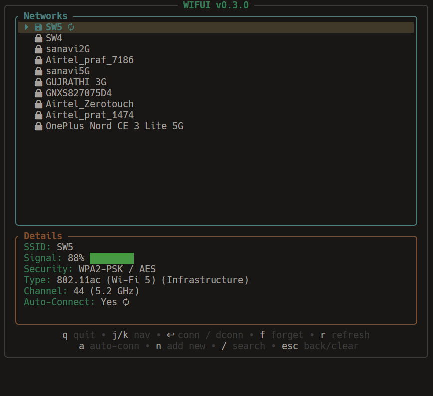
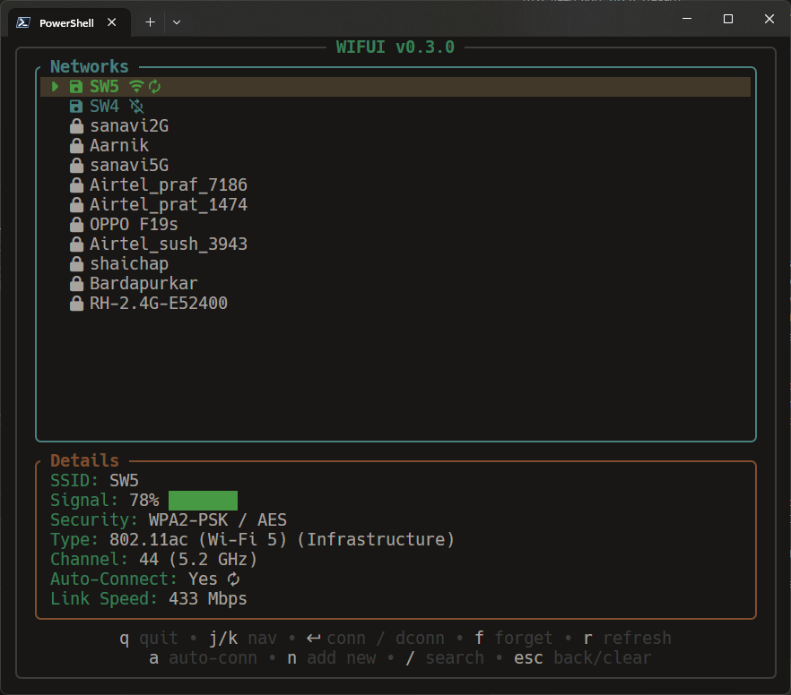
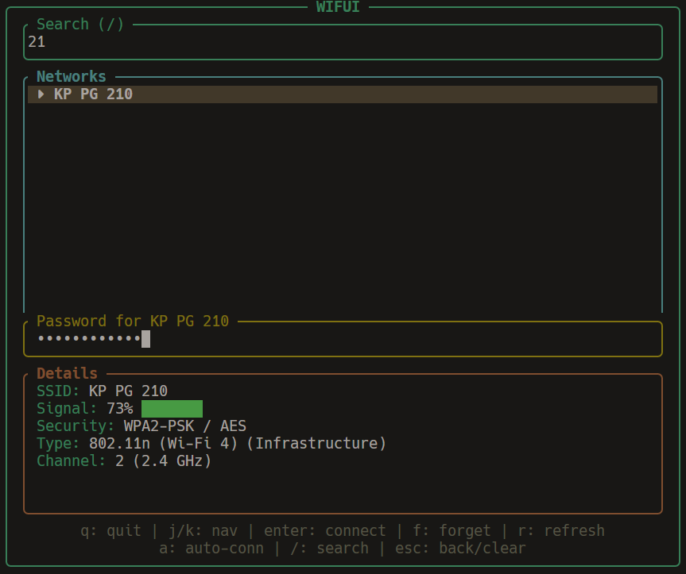

# WifUI

[](https://github.com/sohamw03/wifui/releases)


**WifUI** is a blazing fast, lightweight Terminal User Interface (TUI) for managing Wi-Fi connections on **Windows**. Built with Rust and `ratatui`, it offers a keyboard-centric way to scan, connect, and monitor your network status without leaving the terminal.

## 🚀 Features

- **Network Scanning**: Instantly discover available Wi-Fi networks.
- **Seamless Connection**: Connect to open or secured networks.
- **Network Management**: View detailed network info (SSID, Signal Strength, Security Type, Channel).
- **Keyboard Driven**: Efficient navigation with Vim-like keybindings.

## 📸 Screenshots

| Home Screen | Password Prompt |
|:---:|:---:|
|  |  |

## 📦 Installation

### Winget (Coming Soon)

```sh
winget install wifui
```

### Crates.io

```sh
cargo install wifui
```

### From Source

Ensure you have the [Rust toolchain](https://www.rust-lang.org/tools/install) installed.

```sh
git clone https://github.com/sohamw03/wifui.git
cd wifui
cargo run --release
```

## 🎮 Usage

Run the application:

```sh
wifui
```

### Keybindings

| Key | Action |
| :--- | :--- |
| `↑` / `k` | Move Selection Up |
| `↓` / `j` | Move Selection Down |
| `Enter` | Connect / Disconnect |
| `r` | Refresh Network List |
| `f` | Forget Network |
| `a` | Toggle Auto Connect |
| `q` / `Esc` | Quit |

## 🤝 Contributing

Contributions are welcome! Feel free to open an issue or submit a pull request on [GitHub](https://github.com/sohamw03/wifui).

## 📄 License

This project is licensed under the MIT License.
