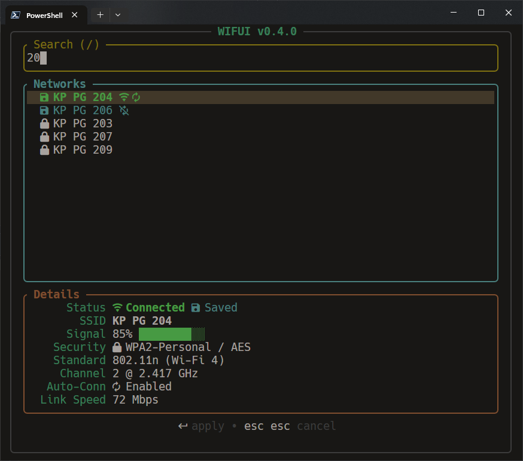

# WifUI

[](https://github.com/sohamw03/wifui/releases)


[](https://github.com/sohamw03/Scoop-Bucket)
[](https://community.chocolatey.org/packages/wifui)
[](https://crates.io/crates/wifui)


**WifUI** is a blazing fast, lightweight Terminal User Interface (TUI) for managing Wi-Fi connections on **Windows**. Built with Rust and `ratatui`, it offers a keyboard-centric way to scan, connect, and monitor your network status without leaving the terminal.

## 🚀 Features

- **Network Scanning**: Instantly discover available Wi-Fi networks.
- **Seamless Connection**: Connect to open or secured networks.
- **Network Management**: View detailed network info (SSID, Signal Strength, Security Type, Channel).
- **Keyboard Driven**: Efficient navigation with Vim-like keybindings.

## 📸 Screenshots

| Home | Search | Password |
|:---:|:---:|:---:|
|  |  |  |

## 📦 Installation

Requires Nerd Fonts — install from https://www.nerdfonts.com/

### Winget

```sh
winget install wifui
```

### [Scoop](https://scoop.sh/#/apps?q=%22https%3A%2F%2Fgithub.com%2Fsohamw03%2FScoop-Bucket%22&o=false)

```sh
scoop bucket add sohamw03 https://github.com/sohamw03/Scoop-Bucket
scoop install wifui
```

### [Chocolatey](https://community.chocolatey.org/packages/wifui)

```sh
choco install wifui
```

### [Crates.io](https://crates.io/crates/wifui)

```sh
cargo install wifui
```

### From Source

Ensure you have the [Rust toolchain](https://www.rust-lang.org/tools/install) installed.

```sh
git clone https://github.com/sohamw03/wifui.git
cd wifui
cargo install --path .
```

## 🎮 Usage

Run the application:

```sh
wifui
```

### Keybindings

| Key | Action |
| :--- | :--- |
| `↑` / `k` | Move Selection Up |
| `↓` / `j` | Move Selection Down |
| `g` | Go to Top |
| `G` | Go to Bottom |
| `Enter` | Connect / Disconnect |
| `n` | Add Manual Network |
| `r` | Refresh Network List |
| `f` | Forget Network |
| `a` | Toggle Auto Connect |
| `/` | Search Networks |
| `q` / `Ctrl + c` | Quit |
| `Esc` | Back / Clear Search / Quit |

### Input Navigation (Search & Password)

| Key | Action |
| :--- | :--- |
| `Esc` / `Ctrl + [` | Clear Input |
| `Ctrl / Alt + Backspace` | Delete Word |
| `Ctrl / Alt + ← / →` | Move Cursor by Word |
| `Home / End` | Move Cursor to Start / End |

## 🤝 Contributing

Contributions are welcome! Feel free to open an issue or submit a pull request on [GitHub](https://github.com/sohamw03/wifui).

## 📄 License

This project is licensed under the MIT License.
