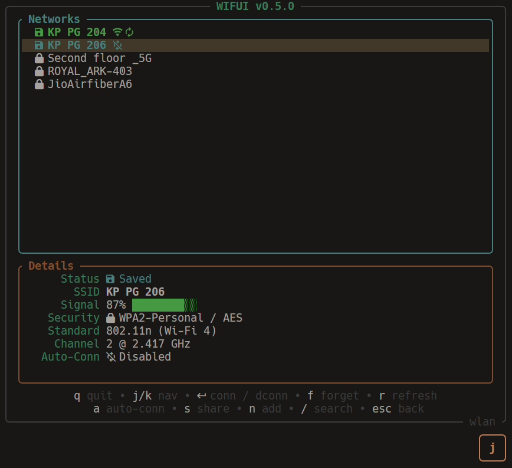
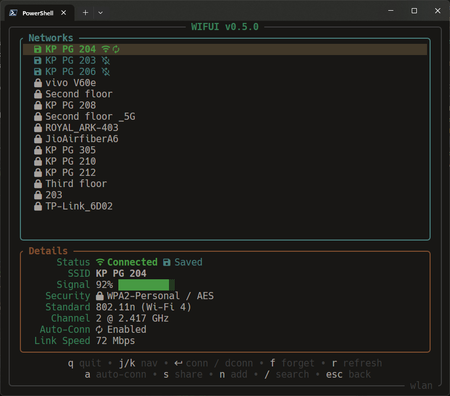
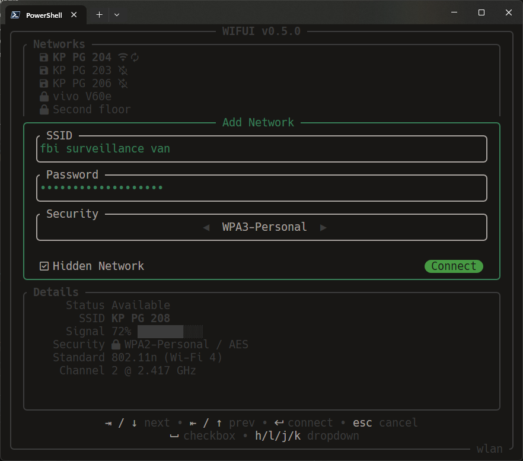
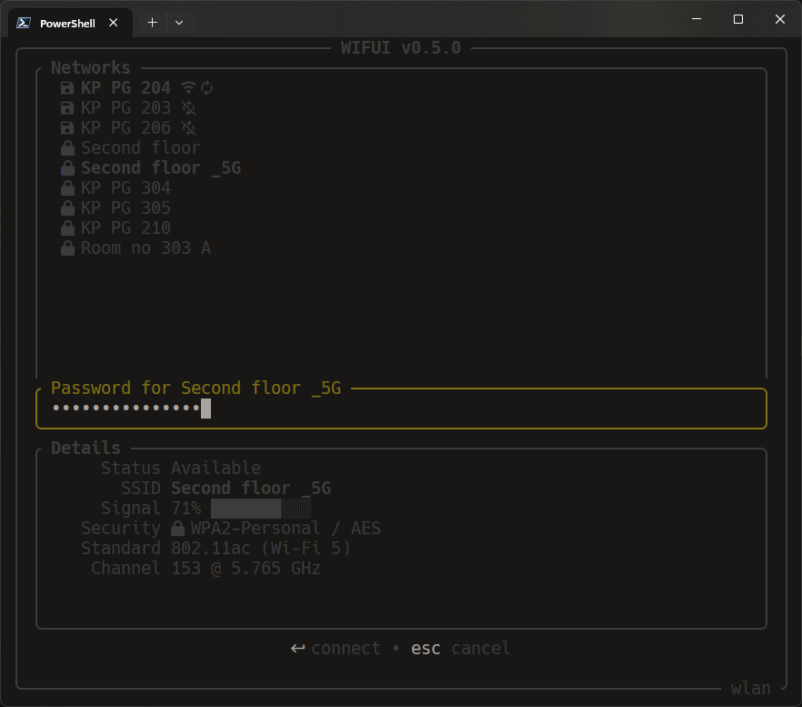
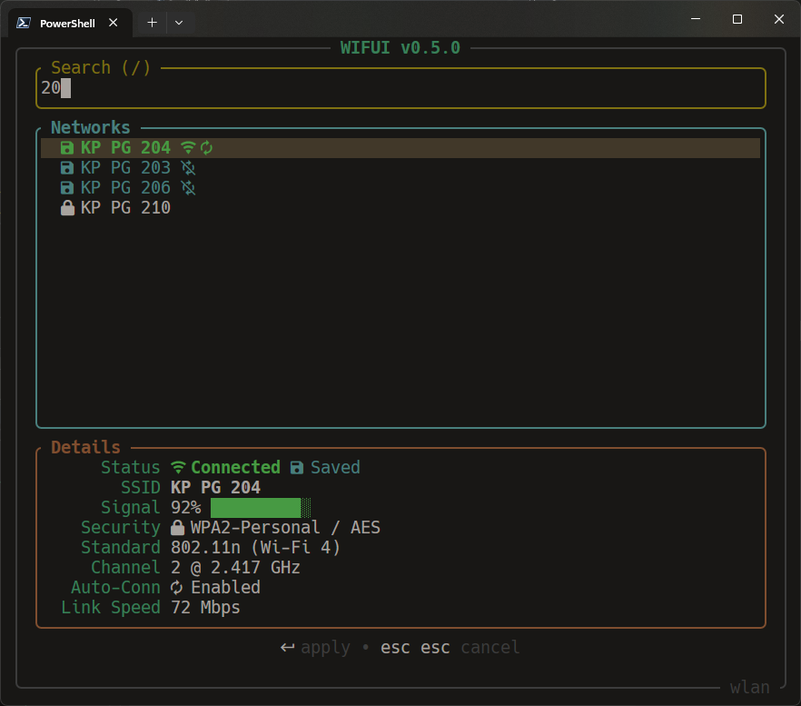
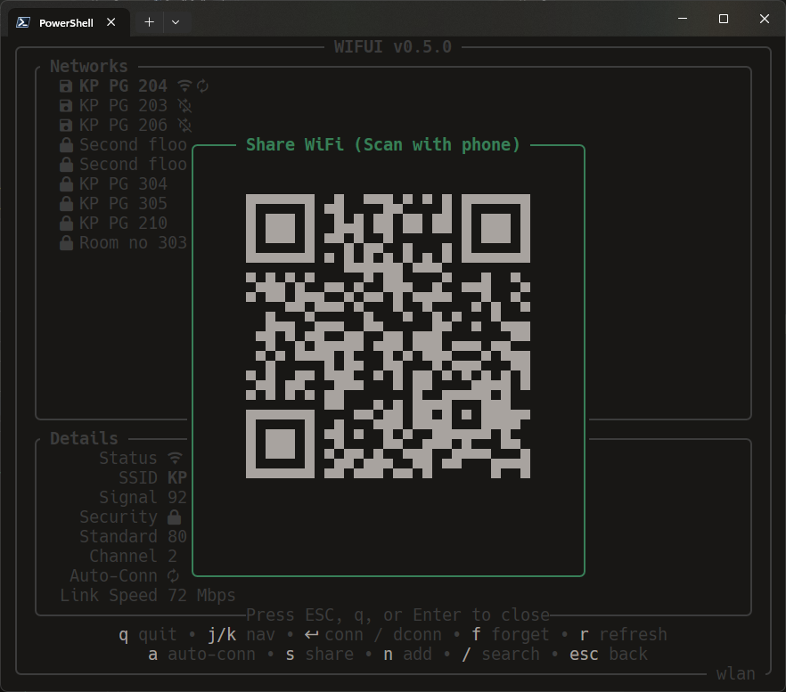

# **WiF**u**i**

[](https://github.com/sohamw03/wifui/releases)


[](https://github.com/sohamw03/Scoop-Bucket)
[](https://community.chocolatey.org/packages/wifui)
[](https://crates.io/crates/wifui)


**WiF**u**i** is a blazing fast, lightweight Terminal User Interface (TUI) for managing Wi-Fi connections on **Windows and Linux**. Built with Rust and `ratatui`, it offers a keyboard-centric way to scan, connect, share, and monitor your network status without leaving the terminal.

Linux support is experimental and uses the system D-Bus through NetworkManager or iwd. NetworkManager is preferred by default; use `--backend iwd` when iwd is the intended manager. Linux currently targets the first usable Wi-Fi interface. NetworkManager can read saved secrets for secured QR sharing; iwd does not expose stored passphrases through its public D-Bus API.

## 🚀 Features

- **Network Scanning**: Instantly discover available Wi-Fi networks.
- **Seamless Connection**: Connect to open or secured networks.
- **Network Management**: View detailed network info (SSID, Signal Strength, Security Type, Channel).
- **Share WiFi**: Generate QR codes for open networks and saved credentials when key material is available.
- **Keyboard Driven**: Efficient navigation with Vim-like keybindings.

## 📸 Screenshots

| Home | Add Network |
|:---:|:---:|
|  |  |
| Password | Search |
|  |  |
| Share |
|  |

## 📦 Installation

**Note:** For the best experience, [Nerd Fonts](https://www.nerdfonts.com/) are recommended. However, you can use the `--ascii` flag if you prefer standard text-based icons.

### Winget

```sh
winget install wifui
```

### [Scoop](https://scoop.sh/#/apps?q=%22https%3A%2F%2Fgithub.com%2Fsohamw03%2FScoop-Bucket%22&o=false)

```sh
scoop bucket add sohamw03 https://github.com/sohamw03/Scoop-Bucket
scoop install wifui
```

### [Chocolatey](https://community.chocolatey.org/packages/wifui)

```sh
choco install wifui
```

### [Crates.io](https://crates.io/crates/wifui)

Works on Linux too. Linux requires NetworkManager or iwd and system D-Bus.

```sh
cargo install wifui
```

### From Source

Ensure you have the [Rust toolchain](https://www.rust-lang.org/tools/install) installed.
```sh
winget install Rustlang.Rustup
winget install --id Microsoft.VisualStudio.2022.BuildTools --override "--passive --wait --add Microsoft.VisualStudio.Component.VC.Tools.x86.x64 --add Microsoft.VisualStudio.Component.Windows11SDK.22621"
```
```sh
git clone https://github.com/sohamw03/wifui.git
cd wifui
cargo install --path .
```

## 🎮 Usage

Run the application:

```sh
wifui
```

Quick-connect to a nearby saved network:

```sh
wifui 204
```

### Command Line Arguments

| Flag | Description |
| :--- | :--- |
| `--ascii` | Use ASCII icons (no Nerd Fonts required) |
| `--show-keys` | Show key logger for debugging |
| `--backend auto\|nm\|iwd` | Select the Linux D-Bus backend (default: `auto`) |
| `SEARCH_TERM` | Quick-connect to a nearby saved network |
| `-v`, `--version` | Print version information |

### Keybindings

| Key | Action |
| :--- | :--- |
| `↑` / `k` | Move Selection Up |
| `↓` / `j` | Move Selection Down |
| `g` / `Home` | Go to Top |
| `G` / `End` | Go to Bottom |
| `Enter` | Connect / Disconnect |
| `n` | Add New Network Manually |
| `r` | Refresh Network List |
| `f` | Forget Network |
| `a` | Toggle Auto Connect |
| `s` | Share WiFi (QR Code) |
| `/` | Search Networks |
| `q` / `Ctrl + c` | Quit |
| `Esc` | Back / Clear Search / Quit |

### Input Navigation (Search & Password)

| Key | Action |
| :--- | :--- |
| `Esc` / `Ctrl + [` | Clear Input |
| `Ctrl / Alt + Backspace` | Delete Word |
| `Ctrl / Alt + ← / →` | Move Cursor by Word |
| `Home / End` | Move Cursor to Start / End |

## 🤝 Contributing

Contributions are welcome! Feel free to open an issue or submit a pull request on [GitHub](https://github.com/sohamw03/wifui).

## 📄 License

This project is licensed under the MIT License.
